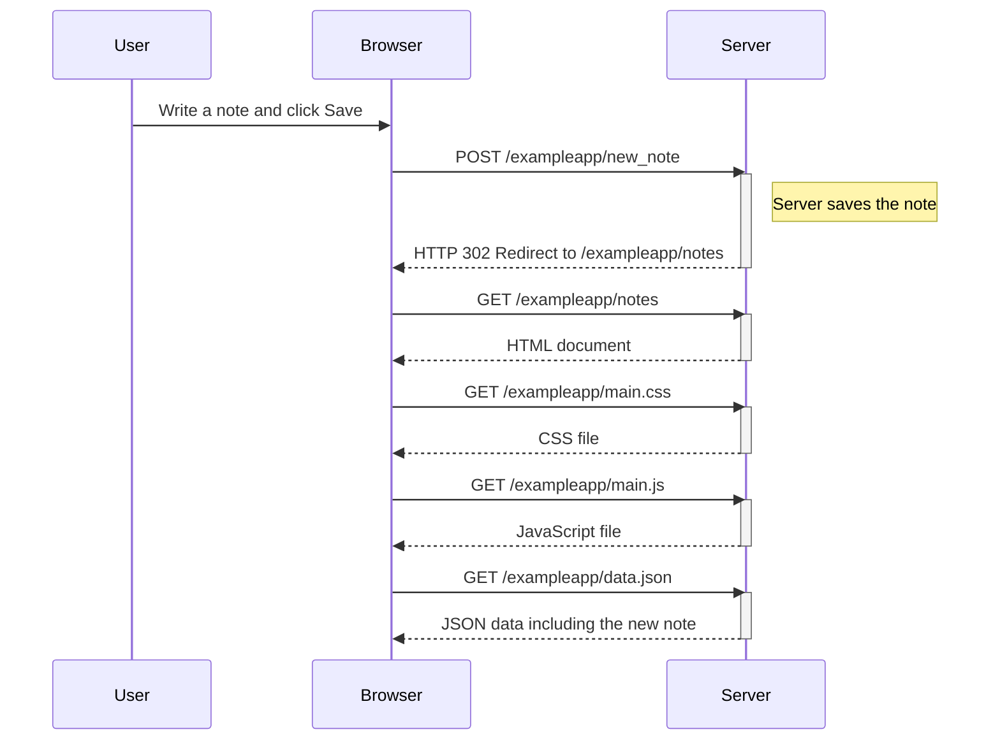

```mermaid
sequenceDiagram
    participant U as User
    participant B as Browser
    participant S as Server

    U->>B: Write a note and click Save
    B->>S: POST /exampleapp/new_note
    activate S
    Note right of S: Server saves the note
    S-->>B: HTTP 302 Redirect to /exampleapp/notes
    deactivate S

    B->>S: GET /exampleapp/notes
    activate S
    S-->>B: HTML document
    deactivate S

    B->>S: GET /exampleapp/main.css
    activate S
    S-->>B: CSS file
    deactivate S

    B->>S: GET /exampleapp/main.js
    activate S
    S-->>B: JavaScript file
    deactivate S

    B->>S: GET /exampleapp/data.json
    activate S
    S-->>B: JSON data including the new note
    deactivate S
```
