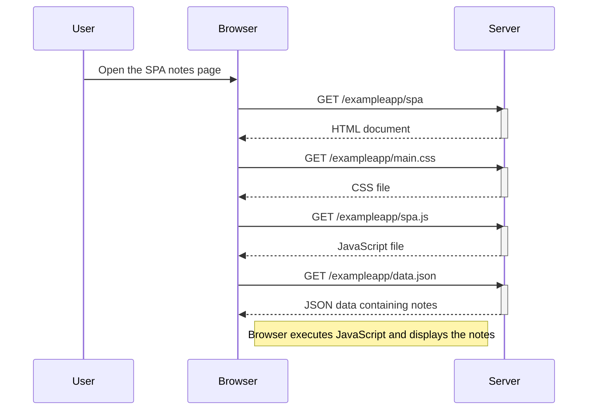

```mermaid
sequenceDiagram
    participant U as User
    participant B as Browser
    participant S as Server

    U->>B: Open the SPA notes page
    B->>S: GET /exampleapp/spa
    activate S
    S-->>B: HTML document
    deactivate S

    B->>S: GET /exampleapp/main.css
    activate S
    S-->>B: CSS file
    deactivate S

    B->>S: GET /exampleapp/spa.js
    activate S
    S-->>B: JavaScript file
    deactivate S

    B->>S: GET /exampleapp/data.json
    activate S
    S-->>B: JSON data containing notes
    deactivate S

    Note right of B: Browser executes JavaScript and displays the notes
```