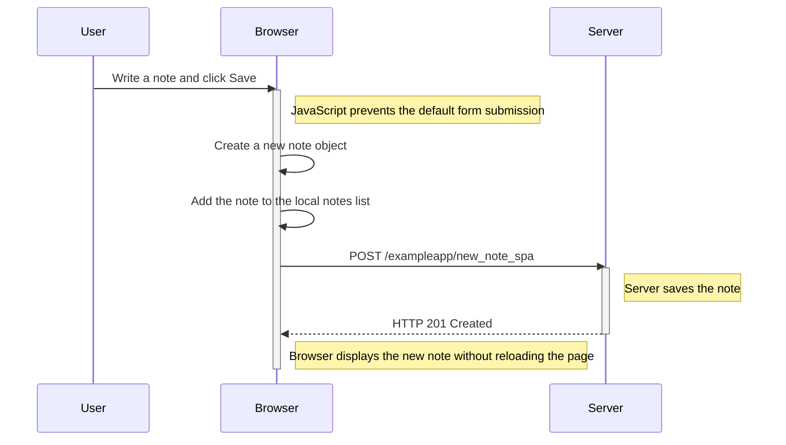

```mermaid
sequenceDiagram
    participant U as User
    participant B as Browser
    participant S as Server

    U->>B: Write a note and click Save
    activate B
    Note right of B: JavaScript prevents the default form submission
    B->>B: Create a new note object
    B->>B: Add the note to the local notes list

    B->>S: POST /exampleapp/new_note_spa
    activate S
    Note right of S: Server saves the note
    S-->>B: HTTP 201 Created
    deactivate S

    Note right of B: Browser displays the new note without reloading the page
    deactivate B
```